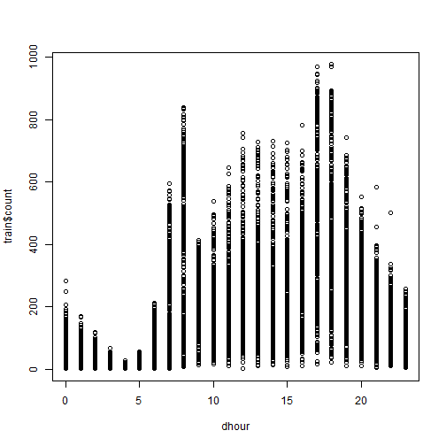
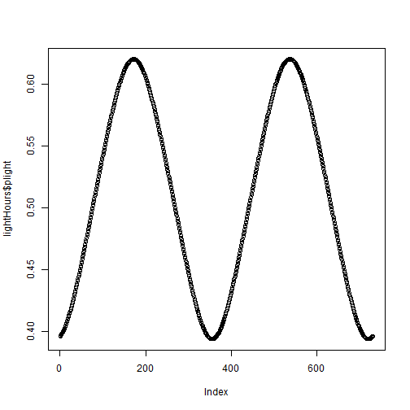

#### Initial assumptions:

* There are cycles: days, weeks and seasons. 
* There are singularities: holidays and adverse weather conditions. 
* There are different uses: transportation and fun. 
* There is a window of optimal conditions: climatic conditions within limits.

#### my wd

```r
setwd("C:\\Users\\Flavio\\Dropbox\\Coursera\\Washington\\IDS\\Kaggle")
```

#### my repository

```r
if(!file.exists("./data")){dir.create("./data")}
```

#### the files

```r
dir()
```

```
##  [1] "bikes_01.docx"      "bikes_01.R"         "Bikes_01.Rmd"      
##  [4] "bikes_02.docx"      "bikes_02.R"         "bikes_03.docx"     
##  [7] "bikes_03.R"         "bikes_04.R"         "classification.png"
## [10] "data"               "Decision_Trees.pdf"
```

```r
trainFile <- "./data/train.csv"
testFile <- "./data/test.csv"
sampleSubmissionFile <- "./data/sampleSubmission.csv"
```

#### notes
I've downloaded then via browser because we need to accept the terms of the competition to get the real data.  
Otherwise, they give you sth else.  

```r
## The original commands, commented:
#
# trainUrl <- "http://www.kaggle.com/c/bike-sharing-demand/download/train.csv"
# download.file(trainUrl,destfile=trainFile)
# testUrl <- "http://www.kaggle.com/c/bike-sharing-demand/download/test.csv"
# download.file(testUrl,destfile=testFile)
# sampleSubmissionUrl <- "http://www.kaggle.com/c/bike-sharing-demand/download/sampleSubmission.csv"
# download.file(sampleSubmissionUrl,destfile=sampleSubmissionFile)
#
```

#### getting the data

```r
train <- read.csv(file=trainFile, header=TRUE)
test <- read.csv(testFile)
sampleSubmission <- read.csv(sampleSubmissionFile)
```

#### first variable, for week cycles

```r
library(data.table)
week_day <- wday(as.Date(train$datetime, format = "%Y-%m-%d %H:%M:%S"))
hist(week_day, breaks=c(0:7), xlab="sun = 0, sat = 7")
```

 

#### second variable, the hour of the day

```r
dhour <- as.numeric(format(strptime(train$datetime, format = "%Y-%m-%d %H:%M:%S"), "%H"))
plot(dhour,train$count)
```

 
#
#### sunrise and sunset at http://www.sunearthtools.com/pt/solar/sunrise-sunset-calendar.php#table

I've constructed one spreadsheet with 3 columns:

* date %Y-%m-%d
* sunrise %h:%m:%s
* sunset %h:%m:%s


```r
lightHoursFile <- "./data/Washington_DayLight_2011_2012.csv"
lightHours <- read.csv(lightHoursFile, skip = 3)
lightHours$date <- as.Date(lightHours$date, format="%Y-%m-%d")
#
deltaSeconds <- function(x) {
    seconds <- 3600 * as.numeric(substring(as.character(x), 1, 2)) +
        60 * as.numeric(substring(as.character(x), 4, 5)) +
        as.numeric(substring(as.character(x), 7, 8))
    return(seconds)
}
```

#### percent of day with sun light

```r
dhour <- as.numeric(format(strptime(train$datetime, format = "%Y-%m-%d %H:%M:%S"), "%H"))
plot(dhour,train$count)
```

 

```r
lightHours$plight <- (deltaSeconds(lightHours$sunset) - deltaSeconds(lightHours$sunrise)) / 86400
```

#### two years cycle

```r
plot(lightHours$plight)
```

 

```r
summary(lightHours$plight)
```

```
##    Min. 1st Qu.  Median    Mean 3rd Qu.    Max. 
##   0.394   0.433   0.509   0.508   0.584   0.620
```

#
#
## Let's play!
#
## First approach: cart
## dependent variable:
##    count
## independent variables:
##   season - discarded
##   plight
##   dhour
##   week_day
##   holiday
##   workingday
##   weather
##   atemp (log)
##   humidity (log)
##   windspeed (log10)
#
dth <- data.table(lightHours, key="date")
t1 <- train
t1$date <- as.Date(t1$datetime, format="%Y-%m-%d")
t1$week_day <- week_day
t1$dhour <- dhour
dtt <- data.table(t1, key="date")
dt <- dth[dtt]
str(dt)
#
## train and test of original train
library(caTools)
set.seed(1108)
split <- sample.split(dt$datetime, SplitRatio = 0.55)
table(split)
#
t1train <- subset(dt, split)
t1test <- subset(dt, !split)
#
library(rpart)
library(rpart.plot)
tree <- rpart(count ~ season + plight + dhour + week_day 
              + holiday + workingday + weather + atemp 
              + humidity + windspeed, data=t1train)
prp(tree)

tree.pred <- as.integer(predict(tree, newdata=t1test))

summary(tree.pred)
summary(t1train$count)
plot(sqrt((tree.pred - t1test$count)^2))
cor(tree.pred, t1test$count)

## now the full train

treeAll <- rpart(count ~ season + plight + dhour + week_day 
                 + holiday + workingday + weather + atemp 
                 + humidity + windspeed, data=dt)
prp(treeAll)

summary(dt$count)

t2 <- test
t2$date <- as.Date(t2$datetime, format="%Y-%m-%d")
t2$week_day <- wday(as.Date(test$datetime, format = "%Y-%m-%d %H:%M:%S"))
t2$dhour <- as.numeric(format(strptime(test$datetime, format = "%Y-%m-%d %H:%M:%S"), "%H"))
dtt2 <- data.table(t2, key="date")
dt2 <- dth[dtt2]

submit.pred <- as.integer(predict(tree, newdata=dt2))
summary(submit.pred)

write.csv(submit.pred, file="./data/sub140808D.csv")

