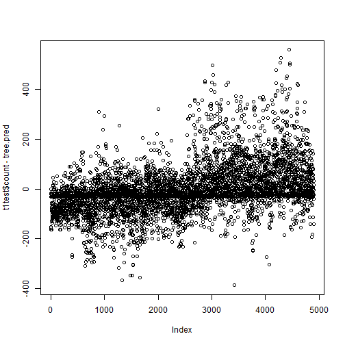

# Brief report  

As this is an open assignment, I prefer to work with something of my interest. Then my choice in the Kaggle competition is the **Bike Sharing Demand**.  

## Forecast use of a city bikeshare system *(from Kaggle)*  

Bike sharing systems are a means of renting bicycles where the process of obtaining membership, rental, and bike return is automated via a network of kiosk locations throughout a city. Using these systems, people are able rent a bike from a one location and return it to a different place on an as-needed basis. Currently, there are over 500 bike-sharing programs around the world.  

The data generated by these systems makes them attractive for researchers because the duration of travel, departure location, arrival location, and time elapsed is explicitly recorded. Bike sharing systems therefore function as a sensor network, which can be used for studying mobility in a city. In this competition, participants are asked to combine historical usage patterns with weather data in order to forecast bike rental demand in the Capital Bikeshare program in Washington, D.C.  

## Tools

I use RStudio and Knitr to make this report. I'm very confortable with this implementation of Knuth's Literate Programming and the result is versioned in GitHub.  

**A tip:** to obtain this .md file and the ./figure directory with the figures:  
- create a **R Markdown file** in RStudio - myreport.Rmd;  
- use Knitr to construct the report in literate programming;  
- execute, in the RStudio console, knitr::knit2html('myreport.Rmd');  
- publish, via GitHub, the report (myreport.md) and the graphs (in /figure).  

## Data files

*__ File Name ________ Available Formats*  
  
- sampleSubmission .csv (139.51 kb)  
- train __________ .csv (633.16 kb)  
- test ___________ .csv (316.27 kb)  

*(from Kaggle)* You are provided hourly rental data spanning two years. For this competition, the training set is comprised of the first 19 days of each month, while the test set is the 20th to the end of the month. You must predict the total count of bikes rented during each hour covered by the test set, using only information available prior to the rental period.  

## Data fields *(from Kaggle)*  

- **datetime** - hourly date + timestamp  
- **season** -  1 = spring, 2 = summer, 3 = fall, 4 = winter 
- **holiday** - whether the day is considered a holiday
- **workingday** - whether the day is neither a weekend nor holiday  
- **weather** - 
    1. Clear, Few clouds, Partly cloudy, Partly cloudy  
    2. Mist + Cloudy, Mist + Broken clouds, Mist + Few clouds, Mist  
    3. Light Snow, Light Rain + Thunderstorm + Scattered clouds, Light Rain + Scattered clouds  
    4. Heavy Rain + Ice Pallets + Thunderstorm + Mist, Snow + Fog  
- **temp** - temperature in Celsius  
- **atemp** - "feels like" temperature in Celsius  
- **humidity** - relative humidity  
- **windspeed** - wind speed  
- **casual** - number of non-registered user rentals initiated  
- **registered** - number of registered user rentals initiated  
- **count** - number of total rentals  

## Advice  

This competition was tailored for the machine learning community, and I'm not prepared yet to play with those technics. So, don't expect a good positioning in the leaderboard. The final date is about 8 months from now. So, there is a possibility of some improvements.  

# My Solution  

I will use some knowledge (against the machine learnig principles).  

## Initial assumptions:  

* There are cycles: days, weeks and seasons.  
* There are singularities: holidays and adverse weather conditions.  
* There are different uses: transportation and fun.  
* There is a window of optimal conditions: climatic conditions within limits.  

## getting the data  
### the wd  

```r
setwd("C:\\Users\\Flavio\\Dropbox\\Coursera\\Washington\\IDS\\Kaggle")
```

### the repository  

```r
if(!file.exists("./data")){dir.create("./data")}
```

### the files  

This snapshot shows the data files and a lot of results obtained more recently. Because the file's repository isn't versioned, I use one name schema to control the versions. The best result until now is described in this report.  

```r
dir("./data")
```

```
##  [1] "acs.csv"                                                          
##  [2] "AnnualSunriseSunset_2011_38.8252657_-77.0471191_1406895560158.xls"
##  [3] "AnnualSunriseSunset_2012_38.8252657_-77.0471191_1406895560158.xls"
##  [4] "AnnualSunriseSunset_2014_38.8252657_-77.0471191_1406895560158.xls"
##  [5] "sampleSubmission.csv"                                             
##  [6] "sub140801A.csv"                                                   
##  [7] "sub140802A.csv"                                                   
##  [8] "sub140803A.csv"                                                   
##  [9] "sub140808A.csv"                                                   
## [10] "sub140808B.csv"                                                   
## [11] "sub140808C.csv"                                                   
## [12] "sub140808D.csv"                                                   
## [13] "sub140808E.csv"                                                   
## [14] "sub140808F.csv"                                                   
## [15] "sub140808G.csv"                                                   
## [16] "sub140808H.csv"                                                   
## [17] "sub140810A.csv"                                                   
## [18] "sub140810B.csv"                                                   
## [19] "sub140810g1A.csv"                                                 
## [20] "sub140810g2A.csv"                                                 
## [21] "sub140810g3A.csv"                                                 
## [22] "sub140810g4A.csv"                                                 
## [23] "sub140810g5A.csv"                                                 
## [24] "sub140810g6A.csv"                                                 
## [25] "sub140810g7A.csv"                                                 
## [26] "sub140810g8A.csv"                                                 
## [27] "test.csv"                                                         
## [28] "train.csv"                                                        
## [29] "Washington_DayLight_2011_2012.csv"
```

```r
trainFile <- "./data/train.csv"
testFile <- "./data/test.csv"
sampleSubmissionFile <- "./data/sampleSubmission.csv"
```

### notes  

I downloaded them via browser because we need to accept the terms of the competition to get the real data - my configuration of Knitr do not permit to respond forms.  
Otherwise, they give us something else.  

```r
## The original commands, commented:
#
# trainUrl <- "http://www.kaggle.com/c/bike-sharing-demand/download/train.csv"
# download.file(trainUrl,destfile=trainFile)
# testUrl <- "http://www.kaggle.com/c/bike-sharing-demand/download/test.csv"
# download.file(testUrl,destfile=testFile)
# sampleSubmissionUrl <- "http://www.kaggle.com/c/bike-sharing-demand/download/sampleSubmission.csv"
# download.file(sampleSubmissionUrl,destfile=sampleSubmissionFile)
#
```

### finally  

```r
train <- read.csv(file=trainFile)
test <- read.csv(testFile)
sampleSubmission <- read.csv(sampleSubmissionFile)
str(sampleSubmission)
```

```
## 'data.frame':	6493 obs. of  2 variables:
##  $ datetime: Factor w/ 6493 levels "2011-01-20 00:00:00",..: 1 2 3 4 5 6 7 8 9 10 ...
##  $ count   : int  0 0 0 0 0 0 0 0 0 0 ...
```

```r
summary(sampleSubmission)
```

```
##                 datetime        count  
##  2011-01-20 00:00:00:   1   Min.   :0  
##  2011-01-20 01:00:00:   1   1st Qu.:0  
##  2011-01-20 02:00:00:   1   Median :0  
##  2011-01-20 03:00:00:   1   Mean   :0  
##  2011-01-20 04:00:00:   1   3rd Qu.:0  
##  2011-01-20 05:00:00:   1   Max.   :0  
##  (Other)            :6487
```

## Adding variables
### first variable, for week cycles

```r
library(data.table)
week_day <- wday(as.Date(train$datetime, format = "%Y-%m-%d %H:%M:%S"))
hist(week_day, breaks=c(0:7), xlab="sun = 0, sat = 7")
```

 

### second variable, the hour of the day

```r
dhour <- as.numeric(format(strptime(train$datetime, format = "%Y-%m-%d %H:%M:%S"), "%H"))
plot(dhour,train$count)
```

 

### third variable, percent of day light
sunrise and sunset at http://www.sunearthtools.com/pt/solar/sunrise-sunset-calendar.php#table  

I got the data for the period and then I've constructed one spreadsheet with 3 columns:  

* **date** %Y-%m-%d  
* **sunrise** %h:%m:%s  
* **sunset** %h:%m:%s  


```r
lightHoursFile <- "./data/Washington_DayLight_2011_2012.csv"
lightHours <- read.csv(lightHoursFile, skip = 3)
lightHours$date <- as.Date(lightHours$date, format="%Y-%m-%d")
#
deltaSeconds <- function(x) {
    seconds <- 3600 * as.numeric(substring(as.character(x), 1, 2)) +
        60 * as.numeric(substring(as.character(x), 4, 5)) +
        as.numeric(substring(as.character(x), 7, 8))
    return(seconds)
}

lightHours$plight <- (deltaSeconds(lightHours$sunset) 
                      - deltaSeconds(lightHours$sunrise)) / 86400
```

#### see the anual cycle - two years plot

```r
plot(lightHours$plight)
```

 

```r
summary(lightHours$plight)
```

```
##    Min. 1st Qu.  Median    Mean 3rd Qu.    Max. 
##   0.394   0.433   0.509   0.508   0.584   0.620
```

## Let's play!

### approach: cart  
- dependent variable:  
-- count  
- independent variables:  
-- season  
-- plight  
-- dhour  
-- week_day  
-- holiday  
-- workingday  
-- weather  
-- atemp  
-- humidity  
-- windspeed  

### preparation  

Merge the information about percent of day light with the original data.  

```r
dth <- data.table(lightHours, key="date")
t1 <- train
t1$date <- as.Date(t1$datetime, format="%Y-%m-%d")
t1$week_day <- week_day
t1$dhour <- dhour
dtt <- data.table(t1, key="date")
dt <- dth[dtt]
str(dt)
```

```
## Classes 'data.table' and 'data.frame':	10886 obs. of  18 variables:
##  $ date      : Date, format: "2011-01-01" "2011-01-01" ...
##  $ sunrise   : Factor w/ 692 levels "05:42:28","05:42:29",..: 670 670 670 670 670 670 670 670 670 670 ...
##  $ sunset    : Factor w/ 708 levels "16:46:09","16:46:10",..: 97 97 97 97 97 97 97 97 97 97 ...
##  $ plight    : num  0.396 0.396 0.396 0.396 0.396 ...
##  $ datetime  : Factor w/ 10886 levels "2011-01-01 00:00:00",..: 1 2 3 4 5 6 7 8 9 10 ...
##  $ season    : int  1 1 1 1 1 1 1 1 1 1 ...
##  $ holiday   : int  0 0 0 0 0 0 0 0 0 0 ...
##  $ workingday: int  0 0 0 0 0 0 0 0 0 0 ...
##  $ weather   : int  1 1 1 1 1 2 1 1 1 1 ...
##  $ temp      : num  9.84 9.02 9.02 9.84 9.84 ...
##  $ atemp     : num  14.4 13.6 13.6 14.4 14.4 ...
##  $ humidity  : int  81 80 80 75 75 75 80 86 75 76 ...
##  $ windspeed : num  0 0 0 0 0 ...
##  $ casual    : int  3 8 5 3 0 0 2 1 1 8 ...
##  $ registered: int  13 32 27 10 1 1 0 2 7 6 ...
##  $ count     : int  16 40 32 13 1 1 2 3 8 14 ...
##  $ week_day  : int  7 7 7 7 7 7 7 7 7 7 ...
##  $ dhour     : num  0 1 2 3 4 5 6 7 8 9 ...
##  - attr(*, "sorted")= chr "date"
##  - attr(*, ".internal.selfref")=<externalptr>
```

### train and test of original train  

Take 55% for train and 45% for test.

```r
library(caTools)
set.seed(1108)
split <- sample.split(dt$datetime, SplitRatio = 0.55)
table(split)
```

```
## split
## FALSE  TRUE 
##  4899  5987
```

```r
#
t1train <- subset(dt, split)
t1test <- subset(dt, !split)
```

### simple model  
CART as described above.

```r
library(rpart)
library(rpart.plot)
tree <- rpart(count ~ season + plight + dhour + week_day 
              + holiday + workingday + weather + atemp 
              + humidity + windspeed, data=t1train)
prp(tree)
```

 

```r
summary(tree)
```

```
## Call:
## rpart(formula = count ~ season + plight + dhour + week_day + 
##     holiday + workingday + weather + atemp + humidity + windspeed, 
##     data = t1train)
##   n= 5987 
## 
##         CP nsplit rel error xerror     xstd
## 1  0.31050      0    1.0000 1.0002 0.023515
## 2  0.08949      1    0.6895 0.6898 0.018600
## 3  0.03405      2    0.6000 0.6120 0.016997
## 4  0.03289      4    0.5319 0.5427 0.015526
## 5  0.01667      6    0.4661 0.4661 0.013377
## 6  0.01530      9    0.4161 0.3908 0.011345
## 7  0.01367     13    0.3452 0.3698 0.010675
## 8  0.01203     14    0.3315 0.3537 0.010107
## 9  0.01076     15    0.3195 0.3445 0.009933
## 10 0.01000     16    0.3087 0.3418 0.009872
## 
## Variable importance
##      dhour      atemp     plight     season workingday   humidity 
##         67         13          7          4          3          2 
##    weather   week_day 
##          2          1 
## 
## Node number 1: 5987 observations,    complexity param=0.3105
##   mean=191, MSE=3.252e+04 
##   left son=2 (1737 obs) right son=3 (4250 obs)
##   Primary splits:
##       dhour    < 6.5    to the left,  improve=0.31050, (0 missing)
##       atemp    < 29.92  to the left,  improve=0.13780, (0 missing)
##       humidity < 66.5   to the right, improve=0.07521, (0 missing)
##       season   < 1.5    to the left,  improve=0.05091, (0 missing)
##       plight   < 0.5008 to the left,  improve=0.03891, (0 missing)
##   Surrogate splits:
##       atemp < 4.168  to the left,  agree=0.711, adj=0.002, (0 split)
## 
## Node number 2: 1737 observations
##   mean=33.77, MSE=1676 
## 
## Node number 3: 4250 observations,    complexity param=0.08949
##   mean=255.2, MSE=3.09e+04 
##   left son=6 (2756 obs) right son=7 (1494 obs)
##   Primary splits:
##       atemp    < 29.92  to the left,  improve=0.13270, (0 missing)
##       season   < 1.5    to the left,  improve=0.10720, (0 missing)
##       dhour    < 20.5   to the right, improve=0.09897, (0 missing)
##       plight   < 0.5008 to the left,  improve=0.07589, (0 missing)
##       humidity < 74.5   to the right, improve=0.03869, (0 missing)
##   Surrogate splits:
##       plight < 0.5607 to the left,  agree=0.832, adj=0.521, (0 split)
## 
## Node number 6: 2756 observations,    complexity param=0.03289
##   mean=208.1, MSE=2.426e+04 
##   left son=12 (552 obs) right son=13 (2204 obs)
##   Primary splits:
##       dhour    < 20.5   to the right, improve=0.09484, (0 missing)
##       season   < 1.5    to the left,  improve=0.09096, (0 missing)
##       atemp    < 18.56  to the left,  improve=0.07558, (0 missing)
##       weather  < 2.5    to the right, improve=0.03020, (0 missing)
##       humidity < 90.5   to the right, improve=0.02092, (0 missing)
## 
## Node number 7: 1494 observations,    complexity param=0.03405
##   mean=342.2, MSE=3.149e+04 
##   left son=14 (213 obs) right son=15 (1281 obs)
##   Primary splits:
##       dhour      < 20.5   to the right, improve=0.104000, (0 missing)
##       humidity   < 57.5   to the right, improve=0.040160, (0 missing)
##       plight     < 0.5317 to the right, improve=0.018820, (0 missing)
##       workingday < 0.5    to the right, improve=0.009111, (0 missing)
##       week_day   < 6.5    to the left,  improve=0.009076, (0 missing)
## 
## Node number 12: 552 observations
##   mean=112.2, MSE=4491 
## 
## Node number 13: 2204 observations,    complexity param=0.03289
##   mean=232.1, MSE=2.633e+04 
##   left son=26 (872 obs) right son=27 (1332 obs)
##   Primary splits:
##       season   < 1.5    to the left,  improve=0.11140, (0 missing)
##       atemp    < 17.8   to the left,  improve=0.08392, (0 missing)
##       weather  < 2.5    to the right, improve=0.03673, (0 missing)
##       dhour    < 16.5   to the left,  improve=0.02760, (0 missing)
##       humidity < 90.5   to the right, improve=0.02378, (0 missing)
##   Surrogate splits:
##       atemp     < 14.77  to the left,  agree=0.734, adj=0.327, (0 split)
##       humidity  < 44.5   to the left,  agree=0.657, adj=0.133, (0 split)
##       plight    < 0.5079 to the left,  agree=0.650, adj=0.115, (0 split)
##       windspeed < 32     to the right, agree=0.618, adj=0.033, (0 split)
## 
## Node number 14: 213 observations
##   mean=201.8, MSE=6074 
## 
## Node number 15: 1281 observations,    complexity param=0.03405
##   mean=365.5, MSE=3.19e+04 
##   left son=30 (781 obs) right son=31 (500 obs)
##   Primary splits:
##       dhour      < 15.5   to the left,  improve=0.20470, (0 missing)
##       humidity   < 57.5   to the right, improve=0.02382, (0 missing)
##       plight     < 0.5317 to the right, improve=0.01520, (0 missing)
##       workingday < 0.5    to the right, improve=0.01177, (0 missing)
##       week_day   < 6.5    to the left,  improve=0.01115, (0 missing)
##   Surrogate splits:
##       season   < 1.5    to the right, agree=0.614, adj=0.012, (0 split)
##       humidity < 22.5   to the right, agree=0.613, adj=0.008, (0 split)
##       plight   < 0.6202 to the left,  agree=0.611, adj=0.004, (0 split)
##       weather  < 2.5    to the left,  agree=0.611, adj=0.004, (0 split)
## 
## Node number 26: 872 observations
##   mean=165.1, MSE=1.472e+04 
## 
## Node number 27: 1332 observations,    complexity param=0.0153
##   mean=275.9, MSE=2.908e+04 
##   left son=54 (172 obs) right son=55 (1160 obs)
##   Primary splits:
##       weather    < 2.5    to the right, improve=0.06961, (0 missing)
##       humidity   < 80.5   to the right, improve=0.04946, (0 missing)
##       dhour      < 15.5   to the left,  improve=0.04194, (0 missing)
##       workingday < 0.5    to the left,  improve=0.02406, (0 missing)
##       atemp      < 17.8   to the left,  improve=0.01426, (0 missing)
##   Surrogate splits:
##       humidity  < 93.5   to the right, agree=0.887, adj=0.128, (0 split)
##       windspeed < 38     to the right, agree=0.874, adj=0.023, (0 split)
## 
## Node number 30: 781 observations,    complexity param=0.01667
##   mean=300.8, MSE=2.198e+04 
##   left son=60 (528 obs) right son=61 (253 obs)
##   Primary splits:
##       workingday < 0.5    to the right, improve=0.17240, (0 missing)
##       week_day   < 6.5    to the left,  improve=0.09963, (0 missing)
##       plight     < 0.5185 to the right, improve=0.01860, (0 missing)
##       dhour      < 8.5    to the right, improve=0.01848, (0 missing)
##       humidity   < 39.5   to the right, improve=0.01258, (0 missing)
##   Surrogate splits:
##       week_day < 6.5    to the left,  agree=0.828, adj=0.470, (0 split)
##       holiday  < 0.5    to the left,  agree=0.702, adj=0.079, (0 split)
##       plight   < 0.6201 to the left,  agree=0.689, adj=0.040, (0 split)
##       atemp    < 42.8   to the left,  agree=0.682, adj=0.020, (0 split)
##       humidity < 21.5   to the right, agree=0.681, adj=0.016, (0 split)
## 
## Node number 31: 500 observations,    complexity param=0.01203
##   mean=466.5, MSE=3.067e+04 
##   left son=62 (92 obs) right son=63 (408 obs)
##   Primary splits:
##       dhour      < 19.5   to the right, improve=0.15270, (0 missing)
##       humidity   < 71.5   to the right, improve=0.09152, (0 missing)
##       workingday < 0.5    to the left,  improve=0.07259, (0 missing)
##       week_day   < 1.5    to the left,  improve=0.04720, (0 missing)
##       plight     < 0.5373 to the right, improve=0.01776, (0 missing)
##   Surrogate splits:
##       humidity < 81     to the right, agree=0.82, adj=0.022, (0 split)
## 
## Node number 54: 172 observations
##   mean=159, MSE=1.997e+04 
## 
## Node number 55: 1160 observations,    complexity param=0.0153
##   mean=293.2, MSE=2.811e+04 
##   left son=110 (368 obs) right son=111 (792 obs)
##   Primary splits:
##       workingday < 0.5    to the left,  improve=0.04143, (0 missing)
##       dhour      < 15.5   to the left,  improve=0.04053, (0 missing)
##       week_day   < 1.5    to the left,  improve=0.02338, (0 missing)
##       atemp      < 17.8   to the left,  improve=0.02251, (0 missing)
##       humidity   < 35.5   to the right, improve=0.01514, (0 missing)
##   Surrogate splits:
##       week_day < 1.5    to the left,  agree=0.829, adj=0.462, (0 split)
##       holiday  < 0.5    to the right, agree=0.710, adj=0.087, (0 split)
## 
## Node number 60: 528 observations,    complexity param=0.01667
##   mean=258.2, MSE=1.347e+04 
##   left son=120 (453 obs) right son=121 (75 obs)
##   Primary splits:
##       dhour     < 8.5    to the right, improve=0.45710, (0 missing)
##       humidity  < 63.5   to the left,  improve=0.06975, (0 missing)
##       atemp     < 35.23  to the right, improve=0.04453, (0 missing)
##       windspeed < 14     to the right, improve=0.03177, (0 missing)
##       week_day  < 3.5    to the left,  improve=0.02573, (0 missing)
##   Surrogate splits:
##       humidity < 78.5   to the left,  agree=0.871, adj=0.093, (0 split)
## 
## Node number 61: 253 observations,    complexity param=0.01667
##   mean=389.8, MSE=2.805e+04 
##   left son=122 (57 obs) right son=123 (196 obs)
##   Primary splits:
##       dhour     < 9.5    to the left,  improve=0.49660, (0 missing)
##       humidity  < 57.5   to the right, improve=0.30250, (0 missing)
##       plight    < 0.5331 to the right, improve=0.13400, (0 missing)
##       windspeed < 18     to the left,  improve=0.07373, (0 missing)
##       season    < 2.5    to the right, improve=0.04770, (0 missing)
##   Surrogate splits:
##       humidity < 71     to the right, agree=0.810, adj=0.158, (0 split)
##       atemp    < 30.68  to the left,  agree=0.783, adj=0.035, (0 split)
## 
## Node number 62: 92 observations
##   mean=322.4, MSE=9409 
## 
## Node number 63: 408 observations
##   mean=499, MSE=2.972e+04 
## 
## Node number 110: 368 observations,    complexity param=0.01367
##   mean=243.1, MSE=2.064e+04 
##   left son=220 (121 obs) right son=221 (247 obs)
##   Primary splits:
##       dhour     < 9.5    to the left,  improve=0.35050, (0 missing)
##       atemp     < 17.8   to the left,  improve=0.12660, (0 missing)
##       humidity  < 51.5   to the right, improve=0.11750, (0 missing)
##       plight    < 0.3942 to the left,  improve=0.02729, (0 missing)
##       windspeed < 14     to the left,  improve=0.02616, (0 missing)
##   Surrogate splits:
##       humidity < 82.5   to the right, agree=0.704, adj=0.099, (0 split)
##       plight   < 0.5948 to the right, agree=0.693, adj=0.066, (0 split)
##       atemp    < 15.53  to the left,  agree=0.693, adj=0.066, (0 split)
## 
## Node number 111: 792 observations,    complexity param=0.0153
##   mean=316.5, MSE=2.987e+04 
##   left son=222 (623 obs) right son=223 (169 obs)
##   Primary splits:
##       dhour     < 8.5    to the right, improve=0.20680, (0 missing)
##       weather   < 1.5    to the right, improve=0.02044, (0 missing)
##       windspeed < 12     to the right, improve=0.01461, (0 missing)
##       plight    < 0.5983 to the left,  improve=0.01455, (0 missing)
##       humidity  < 35.5   to the right, improve=0.01111, (0 missing)
##   Surrogate splits:
##       atemp  < 11.74  to the right, agree=0.802, adj=0.071, (0 split)
##       plight < 0.616  to the left,  agree=0.790, adj=0.018, (0 split)
## 
## Node number 120: 453 observations
##   mean=226.3, MSE=5293 
## 
## Node number 121: 75 observations
##   mean=451, MSE=1.95e+04 
## 
## Node number 122: 57 observations
##   mean=170.9, MSE=7038 
## 
## Node number 123: 196 observations
##   mean=453.4, MSE=1.618e+04 
## 
## Node number 220: 121 observations
##   mean=121.6, MSE=8875 
## 
## Node number 221: 247 observations
##   mean=302.7, MSE=1.563e+04 
## 
## Node number 222: 623 observations,    complexity param=0.0153
##   mean=275.5, MSE=2.224e+04 
##   left son=444 (373 obs) right son=445 (250 obs)
##   Primary splits:
##       dhour     < 15.5   to the left,  improve=0.351900, (0 missing)
##       humidity  < 35.5   to the right, improve=0.052870, (0 missing)
##       weather   < 1.5    to the right, improve=0.040710, (0 missing)
##       atemp     < 23.1   to the left,  improve=0.014660, (0 missing)
##       windspeed < 12     to the right, improve=0.004613, (0 missing)
##   Surrogate splits:
##       humidity < 32.5   to the right, agree=0.612, adj=0.032, (0 split)
##       plight   < 0.6196 to the left,  agree=0.605, adj=0.016, (0 split)
## 
## Node number 223: 169 observations,    complexity param=0.01076
##   mean=467.4, MSE=2.904e+04 
##   left son=446 (79 obs) right son=447 (90 obs)
##   Primary splits:
##       dhour    < 7.5    to the left,  improve=0.42670, (0 missing)
##       humidity < 77.5   to the right, improve=0.06068, (0 missing)
##       week_day < 3.5    to the left,  improve=0.02122, (0 missing)
##       plight   < 0.6163 to the left,  improve=0.01465, (0 missing)
##       atemp    < 14.02  to the left,  improve=0.01420, (0 missing)
##   Surrogate splits:
##       humidity < 69.5   to the right, agree=0.568, adj=0.076, (0 split)
##       week_day < 3.5    to the left,  agree=0.556, adj=0.051, (0 split)
##       plight   < 0.4726 to the right, agree=0.544, adj=0.025, (0 split)
##       weather  < 1.5    to the left,  agree=0.544, adj=0.025, (0 split)
##       atemp    < 10.98  to the left,  agree=0.538, adj=0.013, (0 split)
## 
## Node number 444: 373 observations
##   mean=203.1, MSE=5772 
## 
## Node number 445: 250 observations
##   mean=383.6, MSE=2.731e+04 
## 
## Node number 446: 79 observations
##   mean=348.6, MSE=1.011e+04 
## 
## Node number 447: 90 observations
##   mean=571.7, MSE=2.239e+04
```

### prediction  
Predict - the figures.

```r
tree.pred <- as.integer(predict(tree, newdata=t1test))

summary(tree.pred)
```

```
##    Min. 1st Qu.  Median    Mean 3rd Qu.    Max. 
##      33      33     165     193     302     571
```

```r
summary(t1train$count)
```

```
##    Min. 1st Qu.  Median    Mean 3rd Qu.    Max. 
##       1      43     145     191     281     970
```

### correlation  
The measure of the correlation of the prediction and the real figures.

```r
cor(tree.pred, t1test$count)
```

```
## [1] 0.8252
```

```r
plot(t1test$count - tree.pred)
```

 

### now, the original train
CART with the original train.

```r
treeAll <- rpart(count ~ season + plight + dhour + week_day 
                 + holiday + workingday + weather + atemp 
                 + humidity + windspeed, data=dt)
prp(treeAll)
```

 

```r
summary(treeAll)
```

```
## Call:
## rpart(formula = count ~ season + plight + dhour + week_day + 
##     holiday + workingday + weather + atemp + humidity + windspeed, 
##     data = dt)
##   n= 10886 
## 
##         CP nsplit rel error xerror     xstd
## 1  0.31218      0    1.0000 1.0001 0.017409
## 2  0.08740      1    0.6878 0.6880 0.013790
## 3  0.04947      2    0.6004 0.6088 0.012414
## 4  0.02480      4    0.5015 0.5325 0.010948
## 5  0.02278      7    0.4271 0.4550 0.009584
## 6  0.01871      8    0.4043 0.4393 0.009226
## 7  0.01861      9    0.3856 0.4321 0.009049
## 8  0.01607     10    0.3670 0.4060 0.008741
## 9  0.01391     11    0.3509 0.3532 0.007553
## 10 0.01000     12    0.3370 0.3436 0.007352
## 
## Variable importance
##      dhour      atemp     plight     season workingday   humidity 
##         65         12          8          7          3          2 
##   week_day  windspeed 
##          2          1 
## 
## Node number 1: 10886 observations,    complexity param=0.3122
##   mean=191.6, MSE=3.281e+04 
##   left son=2 (3139 obs) right son=3 (7747 obs)
##   Primary splits:
##       dhour    < 6.5    to the left,  improve=0.31220, (0 missing)
##       atemp    < 29.92  to the left,  improve=0.13000, (0 missing)
##       humidity < 66.5   to the right, improve=0.07428, (0 missing)
##       season   < 1.5    to the left,  improve=0.05650, (0 missing)
##       plight   < 0.4608 to the left,  improve=0.03603, (0 missing)
##   Surrogate splits:
##       atemp < 3.41   to the left,  agree=0.712, adj=0.003, (0 split)
## 
## Node number 2: 3139 observations
##   mean=32.58, MSE=1566 
## 
## Node number 3: 7747 observations,    complexity param=0.0874
##   mean=256, MSE=3.108e+04 
##   left son=6 (3537 obs) right son=7 (4210 obs)
##   Primary splits:
##       atemp    < 23.86  to the left,  improve=0.12970, (0 missing)
##       season   < 1.5    to the left,  improve=0.11010, (0 missing)
##       dhour    < 20.5   to the right, improve=0.10580, (0 missing)
##       plight   < 0.4608 to the left,  improve=0.07043, (0 missing)
##       humidity < 74.5   to the right, improve=0.04042, (0 missing)
##   Surrogate splits:
##       plight    < 0.5008 to the left,  agree=0.844, adj=0.659, (0 split)
##       season    < 1.5    to the left,  agree=0.740, adj=0.431, (0 split)
##       humidity  < 85.5   to the right, agree=0.565, adj=0.048, (0 split)
##       dhour     < 9.5    to the left,  agree=0.564, adj=0.046, (0 split)
##       windspeed < 19.5   to the right, agree=0.559, adj=0.034, (0 split)
## 
## Node number 6: 3537 observations,    complexity param=0.02278
##   mean=186.7, MSE=2.019e+04 
##   left son=12 (1729 obs) right son=13 (1808 obs)
##   Primary splits:
##       season   < 1.5    to the left,  improve=0.11390, (0 missing)
##       dhour    < 19.5   to the right, improve=0.11170, (0 missing)
##       atemp    < 15.53  to the left,  improve=0.07778, (0 missing)
##       weather  < 2.5    to the right, improve=0.02700, (0 missing)
##       humidity < 91     to the right, improve=0.01591, (0 missing)
##   Surrogate splits:
##       atemp     < 14.77  to the left,  agree=0.701, adj=0.389, (0 split)
##       plight    < 0.5079 to the left,  agree=0.616, adj=0.215, (0 split)
##       humidity  < 52.5   to the left,  agree=0.610, adj=0.202, (0 split)
##       windspeed < 18     to the right, agree=0.556, adj=0.091, (0 split)
##       week_day  < 3.5    to the left,  agree=0.524, adj=0.027, (0 split)
## 
## Node number 7: 4210 observations,    complexity param=0.04947
##   mean=314.2, MSE=3.281e+04 
##   left son=14 (694 obs) right son=15 (3516 obs)
##   Primary splits:
##       dhour    < 20.5   to the right, improve=0.120300, (0 missing)
##       humidity < 75.5   to the right, improve=0.070300, (0 missing)
##       atemp    < 30.68  to the left,  improve=0.043810, (0 missing)
##       weather  < 2.5    to the right, improve=0.031750, (0 missing)
##       week_day < 6.5    to the left,  improve=0.006135, (0 missing)
##   Surrogate splits:
##       humidity < 12.5   to the left,  agree=0.836, adj=0.003, (0 split)
## 
## Node number 12: 1729 observations
##   mean=137.7, MSE=1.193e+04 
## 
## Node number 13: 1808 observations,    complexity param=0.01871
##   mean=233.6, MSE=2.359e+04 
##   left son=26 (469 obs) right son=27 (1339 obs)
##   Primary splits:
##       dhour      < 19.5   to the right, improve=0.15670, (0 missing)
##       weather    < 2.5    to the right, improve=0.04494, (0 missing)
##       humidity   < 62.5   to the right, improve=0.04282, (0 missing)
##       workingday < 0.5    to the left,  improve=0.01978, (0 missing)
##       plight     < 0.4786 to the right, improve=0.01817, (0 missing)
## 
## Node number 14: 694 observations
##   mean=172.8, MSE=6095 
## 
## Node number 15: 3516 observations,    complexity param=0.04947
##   mean=342.1, MSE=3.336e+04 
##   left son=30 (2179 obs) right son=31 (1337 obs)
##   Primary splits:
##       dhour    < 15.5   to the left,  improve=0.159700, (0 missing)
##       humidity < 77.5   to the right, improve=0.053510, (0 missing)
##       atemp    < 30.68  to the left,  improve=0.032350, (0 missing)
##       weather  < 2.5    to the right, improve=0.032210, (0 missing)
##       week_day < 6.5    to the left,  improve=0.006996, (0 missing)
##   Surrogate splits:
##       humidity  < 27.5   to the right, agree=0.626, adj=0.016, (0 split)
##       plight    < 0.3995 to the right, agree=0.621, adj=0.003, (0 split)
##       windspeed < 52.5   to the left,  agree=0.620, adj=0.001, (0 split)
## 
## Node number 26: 469 observations
##   mean=130.9, MSE=4569 
## 
## Node number 27: 1339 observations
##   mean=269.6, MSE=2.526e+04 
## 
## Node number 30: 2179 observations,    complexity param=0.0248
##   mean=284.9, MSE=2.385e+04 
##   left son=60 (1534 obs) right son=61 (645 obs)
##   Primary splits:
##       workingday < 0.5    to the right, improve=0.09282, (0 missing)
##       week_day   < 6.5    to the left,  improve=0.05914, (0 missing)
##       weather    < 2.5    to the right, improve=0.03943, (0 missing)
##       dhour      < 8.5    to the right, improve=0.02837, (0 missing)
##       humidity   < 84.5   to the right, improve=0.02424, (0 missing)
##   Surrogate splits:
##       week_day < 1.5    to the right, agree=0.839, adj=0.456, (0 split)
##       holiday  < 0.5    to the left,  agree=0.734, adj=0.101, (0 split)
##       plight   < 0.6201 to the left,  agree=0.708, adj=0.014, (0 split)
##       atemp    < 42.8   to the left,  agree=0.707, adj=0.009, (0 split)
##       humidity < 18.5   to the right, agree=0.704, adj=0.002, (0 split)
## 
## Node number 31: 1337 observations,    complexity param=0.01861
##   mean=435.3, MSE=3.484e+04 
##   left son=62 (508 obs) right son=63 (829 obs)
##   Primary splits:
##       dhour      < 18.5   to the right, improve=0.14270, (0 missing)
##       humidity   < 73.5   to the right, improve=0.13670, (0 missing)
##       atemp      < 29.92  to the left,  improve=0.06462, (0 missing)
##       workingday < 0.5    to the left,  improve=0.05247, (0 missing)
##       weather    < 2.5    to the right, improve=0.04985, (0 missing)
##   Surrogate splits:
##       humidity < 66.5   to the right, agree=0.645, adj=0.065, (0 split)
## 
## Node number 60: 1534 observations,    complexity param=0.0248
##   mean=254.4, MSE=1.762e+04 
##   left son=120 (1262 obs) right son=121 (272 obs)
##   Primary splits:
##       dhour     < 8.5    to the right, improve=0.42000, (0 missing)
##       weather   < 2.5    to the right, improve=0.05641, (0 missing)
##       humidity  < 90.5   to the right, improve=0.02267, (0 missing)
##       windspeed < 14     to the right, improve=0.02195, (0 missing)
##       week_day  < 5.5    to the left,  improve=0.01534, (0 missing)
## 
## Node number 61: 645 observations,    complexity param=0.0248
##   mean=357.5, MSE=3.119e+04 
##   left son=122 (179 obs) right son=123 (466 obs)
##   Primary splits:
##       dhour     < 9.5    to the left,  improve=0.51680, (0 missing)
##       humidity  < 57.5   to the right, improve=0.28770, (0 missing)
##       atemp     < 30.68  to the left,  improve=0.10760, (0 missing)
##       plight    < 0.5331 to the right, improve=0.04967, (0 missing)
##       windspeed < 16     to the left,  improve=0.04219, (0 missing)
##   Surrogate splits:
##       humidity < 72.5   to the right, agree=0.788, adj=0.235, (0 split)
## 
## Node number 62: 508 observations
##   mean=345.2, MSE=1.647e+04 
## 
## Node number 63: 829 observations,    complexity param=0.01607
##   mean=490.5, MSE=3.807e+04 
##   left son=126 (285 obs) right son=127 (544 obs)
##   Primary splits:
##       dhour      < 16.5   to the left,  improve=0.18190, (0 missing)
##       humidity   < 73.5   to the right, improve=0.10530, (0 missing)
##       workingday < 0.5    to the left,  improve=0.05685, (0 missing)
##       weather    < 2.5    to the right, improve=0.05004, (0 missing)
##       atemp      < 29.92  to the left,  improve=0.04399, (0 missing)
##   Surrogate splits:
##       humidity < 22.5   to the left,  agree=0.660, adj=0.011, (0 split)
##       atemp    < 42.8   to the right, agree=0.659, adj=0.007, (0 split)
## 
## Node number 120: 1262 observations
##   mean=214.5, MSE=6308 
## 
## Node number 121: 272 observations
##   mean=439.7, MSE=2.838e+04 
## 
## Node number 122: 179 observations
##   mean=152.6, MSE=8905 
## 
## Node number 123: 466 observations
##   mean=436.2, MSE=1.744e+04 
## 
## Node number 126: 285 observations
##   mean=375.5, MSE=1.617e+04 
## 
## Node number 127: 544 observations,    complexity param=0.01391
##   mean=550.7, MSE=3.899e+04 
##   left son=254 (167 obs) right son=255 (377 obs)
##   Primary splits:
##       workingday < 0.5    to the left,  improve=0.23420, (0 missing)
##       humidity   < 73.5   to the right, improve=0.16120, (0 missing)
##       week_day   < 1.5    to the left,  improve=0.10520, (0 missing)
##       weather    < 2.5    to the right, improve=0.07146, (0 missing)
##       atemp      < 29.92  to the left,  improve=0.07033, (0 missing)
##   Surrogate splits:
##       week_day  < 1.5    to the left,  agree=0.836, adj=0.467, (0 split)
##       holiday   < 0.5    to the right, agree=0.721, adj=0.090, (0 split)
##       plight    < 0.6201 to the right, agree=0.697, adj=0.012, (0 split)
##       windspeed < 42     to the right, agree=0.697, adj=0.012, (0 split)
##       humidity  < 19.5   to the left,  agree=0.695, adj=0.006, (0 split)
## 
## Node number 254: 167 observations
##   mean=407.1, MSE=1.716e+04 
## 
## Node number 255: 377 observations
##   mean=614.3, MSE=3.549e+04
```

```r
summary(dt$count)
```

```
##    Min. 1st Qu.  Median    Mean 3rd Qu.    Max. 
##       1      42     145     192     284     977
```

### preparation of test
Merge the information about percent of day light with the original data. 

```r
t2 <- test
t2$date <- as.Date(t2$datetime, format="%Y-%m-%d")
t2$week_day <- wday(as.Date(test$datetime, format = "%Y-%m-%d %H:%M:%S"))
t2$dhour <- as.numeric(format(strptime(test$datetime, format = "%Y-%m-%d %H:%M:%S"), "%H"))
dtt2 <- data.table(t2, key="date")
dt2 <- dth[dtt2]
```

### prediction  
test predict - the figures.

```r
test.pred <- as.integer(predict(tree, newdata=dt2))
summary(test.pred)
```

```
##    Min. 1st Qu.  Median    Mean 3rd Qu.    Max. 
##      33      33     165     192     226     571
```
**Tip**: this *as.integer* is mandatory. Without him I was the last one in the leaderboard.  

### write response
The file samplesubmission is paired with the test file. So, we can override count with test.pred and use the column names and the date values. Because the data frame test wasn't ordered during the process.

```r
result <- data.table(sampleSubmission, key = "datetime", keep.rownames = )
result$count <- test.pred
write.csv(result, file="./data/sub140808D.csv")
str(result)
```

```
## Classes 'data.table' and 'data.frame':	6493 obs. of  2 variables:
##  $ datetime: Factor w/ 6493 levels "2011-01-20 00:00:00",..: 1 2 3 4 5 6 7 8 9 10 ...
##  $ count   : int  33 33 33 33 33 33 33 165 165 165 ...
##  - attr(*, "sorted")= chr "datetime"
##  - attr(*, ".internal.selfref")=<externalptr>
```
You must open the resulting spreadsheet and delete the first column (unnamed) with the indexes, before submitting the file to Kaggle.  

# Evaluation  

# Some Improvement  
