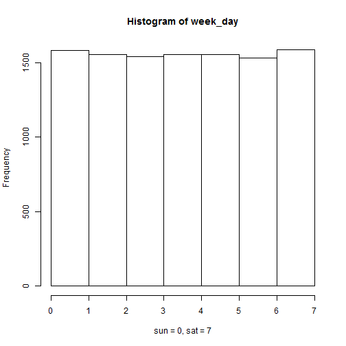
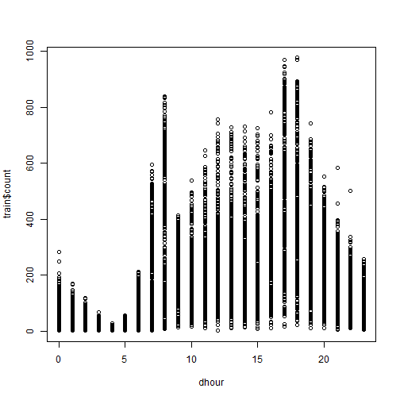
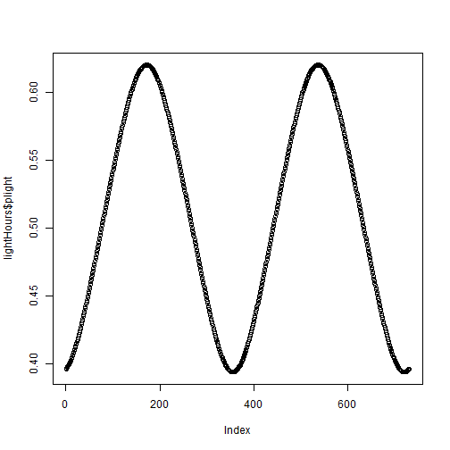
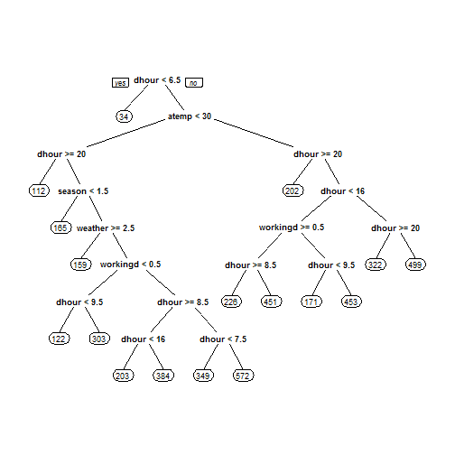
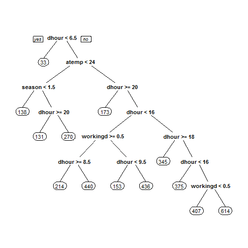

# Brief report  

As this is an open assignment, I prefer to work with something of my interest. Then my choice in the Kaggle competition is the **Bike Sharing Demand**.  

## Forecast use of a city bikeshare system *(from Kaggle)*  

Bike sharing systems are a means of renting bicycles where the process of obtaining membership, rental, and bike return is automated via a network of kiosk locations throughout a city. Using these systems, people are able rent a bike from a one location and return it to a different place on an as-needed basis. Currently, there are over 500 bike-sharing programs around the world.  

The data generated by these systems makes them attractive for researchers because the duration of travel, departure location, arrival location, and time elapsed is explicitly recorded. Bike sharing systems therefore function as a sensor network, which can be used for studying mobility in a city. In this competition, participants are asked to combine historical usage patterns with weather data in order to forecast bike rental demand in the Capital Bikeshare program in Washington, D.C.  

## Tools

I use RStudio and Knitr to make this report. I'm very confortable with this implementation of Knuth's Literate Programming and the result is versioned in GitHub.  

**A tip:** to obtain this .md file and the ./figure directory with the figures:  
- create a **R Markdown file** in RStudio - myreport.Rmd;  
- use Knitr to construct the report in literate programming;  
- execute, in the RStudio console, knitr::knit2html('myreport.Rmd');  
- publish, via GitHub, the report (myreport.md) and the graphs (in /figure).  

## Data files

*__ File Name ________ Available Formats*  
  
- sampleSubmission .csv (139.51 kb)  
- train __________ .csv (633.16 kb)  
- test ___________ .csv (316.27 kb)  

*(from Kaggle)* You are provided hourly rental data spanning two years. For this competition, the training set is comprised of the first 19 days of each month, while the test set is the 20th to the end of the month. You must predict the total count of bikes rented during each hour covered by the test set, using only information available prior to the rental period.  

## Data fields *(from Kaggle)*  

- **datetime** - hourly date + timestamp  
- **season** -  1 = spring, 2 = summer, 3 = fall, 4 = winter 
- **holiday** - whether the day is considered a holiday
- **workingday** - whether the day is neither a weekend nor holiday  
- **weather** - 
    1. Clear, Few clouds, Partly cloudy, Partly cloudy  
    2. Mist + Cloudy, Mist + Broken clouds, Mist + Few clouds, Mist  
    3. Light Snow, Light Rain + Thunderstorm + Scattered clouds, Light Rain + Scattered clouds  
    4. Heavy Rain + Ice Pallets + Thunderstorm + Mist, Snow + Fog  
- **temp** - temperature in Celsius  
- **atemp** - "feels like" temperature in Celsius  
- **humidity** - relative humidity  
- **windspeed** - wind speed  
- **casual** - number of non-registered user rentals initiated  
- **registered** - number of registered user rentals initiated  
- **count** - number of total rentals  

## Advice  

This competition was tailored for the machine learning community, and I'm not prepared yet to play with those technics. So, don't expect a good positioning in the leaderboard. The final date is about 8 months from now. So, there is a possibility of some improvements.  

# My Solution  

I will use some knowledge (against the machine learnig principles).  

## Initial assumptions:  

* There are cycles: days, weeks and seasons.  
* There are singularities: holidays and adverse weather conditions.  
* There are different uses: transportation and fun.  
* There is a window of optimal conditions: climatic conditions within limits.  

## getting data  
### the wd  

```r
setwd("C:\\Users\\Flavio\\Dropbox\\Coursera\\Washington\\IDS\\Kaggle")
```

### the repository  

```r
if(!file.exists("./data")){dir.create("./data")}
```

### the files  

This snapshot shows the data files and a lot of results obtained more recently. Because the file's repository isn't versioned, I use one name schema to control the versions. The best result until now is described in this report.  

```r
dir("./data")
```

```
##  [1] "acs.csv"                                                          
##  [2] "AnnualSunriseSunset_2011_38.8252657_-77.0471191_1406895560158.xls"
##  [3] "AnnualSunriseSunset_2012_38.8252657_-77.0471191_1406895560158.xls"
##  [4] "AnnualSunriseSunset_2014_38.8252657_-77.0471191_1406895560158.xls"
##  [5] "sampleSubmission.csv"                                             
##  [6] "sub140801A.csv"                                                   
##  [7] "sub140802A.csv"                                                   
##  [8] "sub140803A.csv"                                                   
##  [9] "sub140808A.csv"                                                   
## [10] "sub140808B.csv"                                                   
## [11] "sub140808C.csv"                                                   
## [12] "sub140808D.csv"                                                   
## [13] "sub140808E.csv"                                                   
## [14] "sub140808F.csv"                                                   
## [15] "sub140808G.csv"                                                   
## [16] "sub140808H.csv"                                                   
## [17] "sub140810A.csv"                                                   
## [18] "sub140810B.csv"                                                   
## [19] "sub140810g1A.csv"                                                 
## [20] "sub140810g2A.csv"                                                 
## [21] "sub140810g3A.csv"                                                 
## [22] "sub140810g4A.csv"                                                 
## [23] "sub140810g5A.csv"                                                 
## [24] "sub140810g6A.csv"                                                 
## [25] "sub140810g7A.csv"                                                 
## [26] "sub140810g8A.csv"                                                 
## [27] "test.csv"                                                         
## [28] "train.csv"                                                        
## [29] "Washington_DayLight_2011_2012.csv"
```

```r
trainFile <- "./data/train.csv"
testFile <- "./data/test.csv"
sampleSubmissionFile <- "./data/sampleSubmission.csv"
```

### notes  

I downloaded them via browser because we need to accept the terms of the competition to get the real data - my configuration of Knitr do not permit to respond forms.  
Otherwise, they give us something else.  

```r
## The original commands, commented:
#
# trainUrl <- "http://www.kaggle.com/c/bike-sharing-demand/download/train.csv"
# download.file(trainUrl,destfile=trainFile)
# testUrl <- "http://www.kaggle.com/c/bike-sharing-demand/download/test.csv"
# download.file(testUrl,destfile=testFile)
# sampleSubmissionUrl <- "http://www.kaggle.com/c/bike-sharing-demand/download/sampleSubmission.csv"
# download.file(sampleSubmissionUrl,destfile=sampleSubmissionFile)
#
```

### getting the data

```r
train <- read.csv(file=trainFile)
test <- read.csv(testFile)
sampleSubmission <- read.csv(sampleSubmissionFile)
str(sampleSubmission)
```

```
## 'data.frame':	6493 obs. of  2 variables:
##  $ datetime: Factor w/ 6493 levels "2011-01-20 00:00:00",..: 1 2 3 4 5 6 7 8 9 10 ...
##  $ count   : int  0 0 0 0 0 0 0 0 0 0 ...
```

```r
summary(sampleSubmission)
```

```
##                 datetime        count  
##  2011-01-20 00:00:00:   1   Min.   :0  
##  2011-01-20 01:00:00:   1   1st Qu.:0  
##  2011-01-20 02:00:00:   1   Median :0  
##  2011-01-20 03:00:00:   1   Mean   :0  
##  2011-01-20 04:00:00:   1   3rd Qu.:0  
##  2011-01-20 05:00:00:   1   Max.   :0  
##  (Other)            :6487
```

## Adding variables
### first variable, for week cycles

```r
library(data.table)
week_day <- wday(as.Date(train$datetime, format = "%Y-%m-%d %H:%M:%S"))
hist(week_day, breaks=c(0:7), xlab="sun = 0, sat = 7")
```

 

### second variable, the hour of the day

```r
dhour <- as.numeric(format(strptime(train$datetime, format = "%Y-%m-%d %H:%M:%S"), "%H"))
plot(dhour,train$count)
```

 

### third variable, percent of day light
sunrise and sunset at http://www.sunearthtools.com/pt/solar/sunrise-sunset-calendar.php#table  

I got the data for the period and then I've constructed one spreadsheet with 3 columns:  

* **date** %Y-%m-%d  
* **sunrise** %h:%m:%s  
* **sunset** %h:%m:%s  


```r
lightHoursFile <- "./data/Washington_DayLight_2011_2012.csv"
lightHours <- read.csv(lightHoursFile, skip = 3)
lightHours$date <- as.Date(lightHours$date, format="%Y-%m-%d")
#
deltaSeconds <- function(x) {
    seconds <- 3600 * as.numeric(substring(as.character(x), 1, 2)) +
        60 * as.numeric(substring(as.character(x), 4, 5)) +
        as.numeric(substring(as.character(x), 7, 8))
    return(seconds)
}

lightHours$plight <- (deltaSeconds(lightHours$sunset) 
                      - deltaSeconds(lightHours$sunrise)) / 86400
```

#### see the anual cycle - two years plot

```r
plot(lightHours$plight)
```

 

```r
summary(lightHours$plight)
```

```
##    Min. 1st Qu.  Median    Mean 3rd Qu.    Max. 
##   0.394   0.433   0.509   0.508   0.584   0.620
```

## Let's play!

### approach: cart  
- dependent variable:  
-- count  
- independent variables:  
-- season  
-- plight  
-- dhour  
-- week_day  
-- holiday  
-- workingday  
-- weather  
-- atemp  
-- humidity  
-- windspeed  

### preparation  

```r
dth <- data.table(lightHours, key="date")
t1 <- train
t1$date <- as.Date(t1$datetime, format="%Y-%m-%d")
t1$week_day <- week_day
t1$dhour <- dhour
dtt <- data.table(t1, key="date")
dt <- dth[dtt]
str(dt)
```

```
## Classes 'data.table' and 'data.frame':	10886 obs. of  18 variables:
##  $ date      : Date, format: "2011-01-01" "2011-01-01" ...
##  $ sunrise   : Factor w/ 692 levels "05:42:28","05:42:29",..: 670 670 670 670 670 670 670 670 670 670 ...
##  $ sunset    : Factor w/ 708 levels "16:46:09","16:46:10",..: 97 97 97 97 97 97 97 97 97 97 ...
##  $ plight    : num  0.396 0.396 0.396 0.396 0.396 ...
##  $ datetime  : Factor w/ 10886 levels "2011-01-01 00:00:00",..: 1 2 3 4 5 6 7 8 9 10 ...
##  $ season    : int  1 1 1 1 1 1 1 1 1 1 ...
##  $ holiday   : int  0 0 0 0 0 0 0 0 0 0 ...
##  $ workingday: int  0 0 0 0 0 0 0 0 0 0 ...
##  $ weather   : int  1 1 1 1 1 2 1 1 1 1 ...
##  $ temp      : num  9.84 9.02 9.02 9.84 9.84 ...
##  $ atemp     : num  14.4 13.6 13.6 14.4 14.4 ...
##  $ humidity  : int  81 80 80 75 75 75 80 86 75 76 ...
##  $ windspeed : num  0 0 0 0 0 ...
##  $ casual    : int  3 8 5 3 0 0 2 1 1 8 ...
##  $ registered: int  13 32 27 10 1 1 0 2 7 6 ...
##  $ count     : int  16 40 32 13 1 1 2 3 8 14 ...
##  $ week_day  : int  7 7 7 7 7 7 7 7 7 7 ...
##  $ dhour     : num  0 1 2 3 4 5 6 7 8 9 ...
##  - attr(*, "sorted")= chr "date"
##  - attr(*, ".internal.selfref")=<externalptr>
```

### train and test of original train  

```r
library(caTools)
set.seed(1108)
split <- sample.split(dt$datetime, SplitRatio = 0.55)
table(split)
```

```
## split
## FALSE  TRUE 
##  4899  5987
```

```r
#
t1train <- subset(dt, split)
t1test <- subset(dt, !split)
```

### simple model  

```r
library(rpart)
library(rpart.plot)
tree <- rpart(count ~ season + plight + dhour + week_day 
              + holiday + workingday + weather + atemp 
              + humidity + windspeed, data=t1train)
prp(tree)
```

 

### prediction  

```r
tree.pred <- as.integer(predict(tree, newdata=t1test))

summary(tree.pred)
```

```
##    Min. 1st Qu.  Median    Mean 3rd Qu.    Max. 
##      33      33     165     193     302     571
```

```r
summary(t1train$count)
```

```
##    Min. 1st Qu.  Median    Mean 3rd Qu.    Max. 
##       1      43     145     191     281     970
```

### correlation  

```r
cor(tree.pred, t1test$count)
```

```
## [1] 0.8252
```

### now the full train

```r
treeAll <- rpart(count ~ season + plight + dhour + week_day 
                 + holiday + workingday + weather + atemp 
                 + humidity + windspeed, data=dt)
prp(treeAll)
```

 

```r
summary(dt$count)
```

```
##    Min. 1st Qu.  Median    Mean 3rd Qu.    Max. 
##       1      42     145     192     284     977
```

```r
t2 <- test
t2$date <- as.Date(t2$datetime, format="%Y-%m-%d")
t2$week_day <- wday(as.Date(test$datetime, format = "%Y-%m-%d %H:%M:%S"))
t2$dhour <- as.numeric(format(strptime(test$datetime, format = "%Y-%m-%d %H:%M:%S"), "%H"))
dtt2 <- data.table(t2, key="date")
dt2 <- dth[dtt2]

submit.pred <- as.integer(predict(tree, newdata=dt2))
summary(submit.pred)
```

```
##    Min. 1st Qu.  Median    Mean 3rd Qu.    Max. 
##      33      33     165     192     226     571
```

```r
write.csv(submit.pred, file="./data/sub140808D.csv")
```

# Evaluation  

# Some Improvement  
